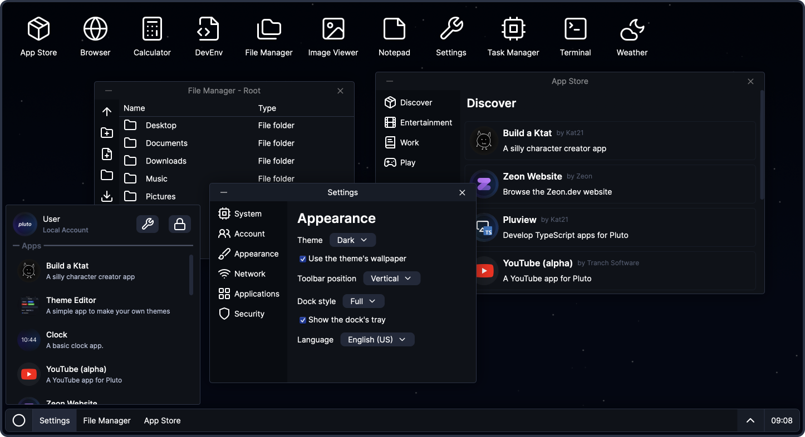

# Pluto v1.5

Pluto is a minimal but functional "web OS" that aims to provide a desktop environment-like experience inside of a website.

<picture>
  <source media="(prefers-color-scheme: light)" srcset="assets/images/ss_light.png">
  
</picture>

## Features

- Clean and minimal UI design, focused on personalization
- Simple file system
- Easy to create your own apps

## Documentation

You can find documentation in the [docs](docs/) folder.

## Contributing

It is recommended to use [VS Code](https://code.visualstudio.com) along with the Live Server and Prettier extensions for the best experience when contributing and a higher chance of your pull request being approved.
