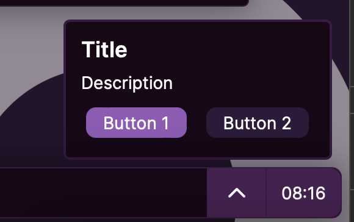
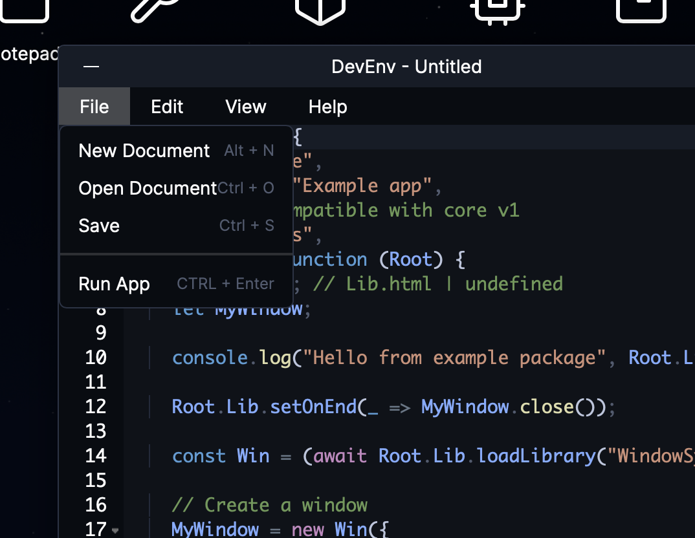

# Libraries and Components

[Back to README.md](README.md)

- [Libraries and Components](#libraries-and-components)
  - [Libraries](#libraries)
    - [CodeScanner](#codescanner)
    - [CtxMenu](#ctxmenu)
    - [FileDialog](#filedialog)
    - [FileMappings](#filemappings)
    - [Notify](#notify)
    - [Registry](#registry)
    - [ThemeLib](#themelib)
    - [VirtualFS](#virtualfs)
  - [Components](#components)
    - [Card](#card)
    - [ImageButton](#imagebutton)
    - [MenuBar](#menubar)
    - [SelectList](#selectlist)
    - [Sidebar](#sidebar)
    - [TextSidebar](#textsidebar)
    - [Tooltip](#tooltip)

There are a selection of libraries and components available.

## Libraries

You can load a library into your app with the following code:

```js
const lib = await Root.Lib.loadLibrary("libraryName");
```

Library names are treated as **case sensitive**!

Here is the list of available libraries:

[CodeScanner](#codescanner)  
[CtxMenu](#ctxmenu)  
[FileDialog](#filedialog)  
[FileMappings](#filemappings)  
[Notify](#notify)  
[Registry](#registry)
[ThemeLib](#themelib)  
[VirtualFS](virtualFS.md)  
[WindowSystem](README.md#example-app-code)

Below is some simple documentation that should be easy enough to understand. Images are provided to understand what the library creates or does.

---

### CodeScanner

These function are undocumented for now.

- `isCodeDangerous(code)`
- `async scanFolder(folder = "Root")`
- `getFileExtension(filename)`
- `async scanForDangerousCode()`

### CtxMenu

```js
new (
  posX,
  posY,
  items = [ { item: "Nothing", select: () => null } ],
  header = "",
  parent = document.body,
  isAbsolute = true,
  isHtml = false
)
```

isHtml can be configured so the items are HTML. See how it is used in the MenuBar component code for examples.

Show a context menu:


<details>

<summary>View code</summary>

```js
const ctxMenu = await Root.Lib.loadLibrary("CtxMenu");

ctxMenu.new(e.clientX, e.clientY, [
  {
    item: Root.Lib.getString("refresh"),
    async select() { ... },
  },
  {
    item: Root.Lib.getString("systemApp_FileManager"),
    async select() { ... },
  },
  {
    item: Root.Lib.getString("systemApp_Settings"),
    async select() { ... },
  },
]);
```

</details>

### FileDialog

- `async pickFile(path)` - Show a file picker
- `saveFile(path)` - Show a save file picker

### FileMappings

- `async retrieveAllMIMEData(path)` - Get metadata information for a file
- `getType(extension)` - Get information about a file extension
- `getLabel(extension)` - Ditto function, it does exactly the same thing

### Notify

`show(title, description, parent = null, buttons = null, autoHide = null, sound = null, soundLoops = false, closeCallback = null)` - Show a notification:


```js
Notify.show("Title", "Description");
```

Notifications can also use buttons:



```js
Notify.show("Title", "Description", null, [
  {
    text: "Button 1",
    type: "primary",
    callback: () => {
      alert(1);
    },
  },
  {
    text: "Button 2",
    callback: () => {
      alert(2);
    },
  },
]);
```

You can also customize the notification sound:

```js
Notify.show("Pluto Messenger", "Rick Astley is calling...", null, [
  {
    text: "Accept",
    type: "primary",
    callback: () => {
      alert("Never gonna give you up");
    },
  },
  {
    text: "Decline",
    callback: () => { ... },
  },
], false, "https://example.com/ringtone.mp3");
```

`closeCallback` is a function that returns a single parameter which is the hide function to cloes the notification.

### Registry

This is a new API to create a simple file system registry key/value store.

**(It is highly recommended use the first argument as the developer name and the second argument as your app name.)**

- `createStore(parent, name)` - Create a registry store.

Registry store:

- `async set(key, value)` - Set the key to the value
- `async get(key)` - Get the value of a key
- `async delete(key)` - Deletes the key

As the Registry KV api depends on the VirtualFS, it is async. You have to await every entry to it.

Example code:

```js
let KV = await Root.Lib.loadLibrary("Registry");

const store = await KV.createStore("MyName", "Example"); // creates Registry/MyName/Example

// Setting
await store.set("test", { real: true, number: 1234, string: "hi" });
// stored as Registry/MyName/Example/test

// Retrieving
console.log(await store.get("test")); // { real: true, number: 1234, string: "hi" }

// delete the test key
await store.delete("test");
```

### ThemeLib

- `validateTheme(theme)`: Parse a theme JSON.
- `async setCurrentTheme(theme)`: Apply the theme to the DOM.
- `async setWallpaper(wallpaper)`: If a desktop is running, tell it to set the wallpaper.

### VirtualFS

[See VirtualFS](virtualFS.md)

---

## Components

Components are similar to libraries, but act like reusable functions to generate HTML elements.

You can load a component into your app with the following code:

```js
const cmp = await Root.Lib.loadComponent("componentName");
```

Here is the list of available components:

[Card](#card)  
[ImageButton](#imagebutton)  
[MenuBar](#menubar)  
[SelectList](#selectlist)  
[Sidebar](#sidebar)  
[TextSidebar](#textsidebar)  
[Tooltip](#tooltip)

---

### Card

`new(wrapper, content) => Html`;


```js
Card.new(container, new Html("div").class("flex-group", "col").text("Hello!"));
```

### ImageButton

`new(wrapper, imageUri)` create image button (unused)

### MenuBar

Create a horizontal menu bar, useful if you have a bunch of actions.



<details>

<summary>View code</summary>

You can also add the `icon` parameter here along with an icon from Root.Lib.icons into any of the menu items.

```js
MenuBar.new(sidebarWrapper, [
  {
    item: "File",
    items: [
      {
        item: Root.Lib.getString("action_newDocument"),
        key: "Alt + N",
        select() {
          actionHandlers.newDocument();
        },
      },
      {
        item: Root.Lib.getString("action_openDocument"),
        key: "Ctrl + O",
        select() {
          actionHandlers.openFile();
        },
      },
      {
        item: Root.Lib.getString("action_save"),
        key: "Ctrl + S",
        select() {
          actionHandlers.save();
        },
      },
      { type: "separator" },
      {
        item: Root.Lib.getString("action_runApp"),
        key: "CTRL + Enter",
        select() {
          actionHandlers.run();
        },
      },
    ],
  },
  {
    item: "Edit",
    items: [
      {
        item: Root.Lib.getString("action_format"),
        key: "Ctrl + Shift + S",
        select() {
          actionHandlers.prettify();
        },
      },
      {
        item: Root.Lib.getString("systemApp_Settings"),
        key: "Ctrl + .",
        select() {
          actionHandlers.settings();
        },
      },
    ],
  },
  {
    item: "View",
    items: [
      {
        item: Root.Lib.getString("action_zoomIn"),
        key: "Ctrl + -",
        select() {
          actionHandlers.zoomIn();
        },
      },
      {
        item: Root.Lib.getString("action_zoomOut"),
        key: "Ctrl + =",
        select() {
          actionHandlers.zoomOut();
        },
      },
    ],
  },
  {
    item: "Help",
    items: [
      {
        item: Root.Lib.getString("appDocumentation"),
        select() {
          actionHandlers.viewDocs();
        },
      },
      {
        item: Root.Lib.getString("appHelp"),
        select() {
          actionHandlers.help();
        },
      },
    ],
  },
]);
```

</details>

<details>

<summary>A more simple example</summary>

```js
MenuBar.new(wrapper, [
  {
    item: "File",
    items: [
      {
        item: "New",
        select() {
          alert("New");
        },
      },
      {
        item: "Open...",
        select() {
          alert("Open...");
        },
      },
      {
        item: "Save",
        select() {
          alert("Save");
        },
      },
      {
        item: "Save As...",
        select() {
          alert("Save As");
        },
      },
    ],
  },
  {
    item: "Edit",
    items: [
      {
        item: "Cut",
        select() {
          alert("Cut");
        },
      },
      {
        item: "Copy",
        select() {
          alert("Copy");
        },
      },
      {
        item: "Paste",
        select() {
          alert("Paste");
        },
      },
    ],
  },
  {
    item: "View",
    items: [
      {
        item: "Zoom In",
        select() {
          alert("Zoom In");
        },
      },
      {
        item: "Zoom Out",
        select() {
          alert("Zoom Out");
        },
      },
      {
        item: "Reset Zoom",
        select() {
          alert("Reset Zoom");
        },
      },
    ],
  },
]);
```

</details>

### SelectList

`buttonList: (wrapper, buttons)`


<details>

<summary>View code</summary>

```js
const SelectList = await Root.Lib.loadComponent("SelectList");

// . . .

const list = SelectList.buttonList(container, [
  {
    html: "Option 1",
    onclick: () => Root.Modal.alert("Option 1 clicked!"),
  },
  {
    html: "Option 2",
    onclick: () => Root.Modal.alert("Option 2 clicked!"),
  },
  // ...
]);
```

</details>

`table: (wrapper, buttons)`


<details>

<summary>View code</summary>

```js
const SelectList = await Root.Lib.loadComponent("SelectList");

// . . .

const list = SelectList.table(container, [
  {
    html: "Option 1",
    onclick: () => Root.Modal.alert("Option 1 clicked!"),
  },
  {
    html: "Option 2",
    onclick: () => Root.Modal.alert("Option 2 clicked!"),
  },
  // ...
]);
```

</details>

### Sidebar

`new(wrapper, buttons)`


<details>

<summary>View code</summary>

```js
const Sidebar = await Root.Lib.loadComponent("Sidebar");

Sidebar.new(sidebarWrapper, [
  {
    onclick: () => { ... },
    html: Root.Lib.icons.newFile,
    title: Root.Lib.getString("action_newDocument"),
  },
  {
    onclick: () => { ... },
    html: Root.Lib.icons.openFolder,
    title: Root.Lib.getString("action_openDocument"),
  },
  {
    onclick: () => { ... },
    html: Root.Lib.icons.save,
    title: Root.Lib.getString("action_save"),
  },
  {
    onclick: () => { ... },
    html: Root.Lib.icons.saveAll,
    title: Root.Lib.getString("action_saveAs"),
  },
  {
    style: {
      "margin-top": "auto",
    },
    onclick: () => { ... },
    html: Root.Lib.icons.help,
    title: Root.Lib.getString("appHelp"),
  },
]);
```

</details>

### TextSidebar

`new(wrapper, buttons)`


<details>

<summary>View code</summary>

```js
TextSidebar.new(wrapper, [
  {
    icon: Root.Lib.icons.cpu,
    text: Root.Lib.getString("system"),
    title: Root.Lib.getString("system"),
    onclick() {
      pages.system();
    },
  },
  {
    icon: Root.Lib.icons.users,
    text: Root.Lib.getString("account"),
    title: Root.Lib.getString("account"),
    onclick() {
      pages.account();
    },
  },
  {
    icon: Root.Lib.icons.brush,
    text: Root.Lib.getString("appearance"),
    title: Root.Lib.getString("appearance"),
    onclick() {
      pages.appearance();
    },
  },
  {
    icon: Root.Lib.icons.wifiConnected,
    text: Root.Lib.getString("network"),
    title: Root.Lib.getString("network"),
    onclick() {
      pages.network();
    },
  },
  {
    icon: Root.Lib.icons.application,
    text: Root.Lib.getString("applications"),
    title: Root.Lib.getString("applications"),
    onclick() {
      pages.applications();
    },
  },
  {
    icon: Root.Lib.icons.shield,
    text: Root.Lib.getString("security"),
    title: Root.Lib.getString("security"),
    onclick() {
      pages.security();
    },
  },
]);
```

</details>

### Tooltip

```js
new (
  posX = 0,
  posY = 0,
  text = "Action",
  parent = document.body,
  isAbsolute = true
)
```

Example


<details>

<summary>View code</summary>

```js
const Tooltip = await Root.Lib.loadComponent("Tooltip");

const bcr = button.elm.getBoundingClientRect();

Tooltip.new(
  bcr.left + bcr.width / 2,
  bcr.bottom - 36,
  "Example",
  document.body,
  true
);
```

</details>
