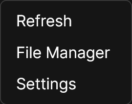
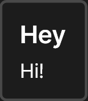
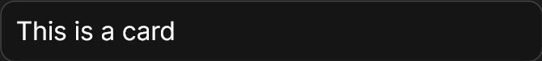
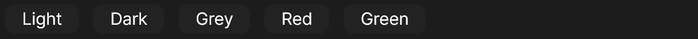
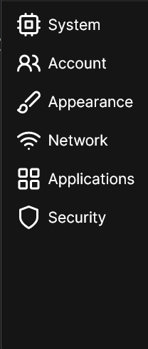
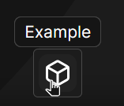

# Libraries and Components

[Back to README.md](README.md)

- [Libraries and Components](#libraries-and-components)
  - [Libraries](#libraries)
    - [CodeScanner](#codescanner)
    - [CtxMenu](#ctxmenu)
    - [FileDialog](#filedialog)
    - [FileMappings](#filemappings)
    - [Notify](#notify)
    - [ThemeLib](#themelib)
    - [VirtualFS](#virtualfs)
  - [Components](#components)
    - [Card](#card)
    - [ImageButton](#imagebutton)
    - [SelectList](#selectlist)
    - [Sidebar](#sidebar)
    - [TextSidebar](#textsidebar)
    - [Tooltip](#tooltip)

There are a selection of libraries and components available.

## Libraries

You can load a library into your app with the following code:

```js
const lib = await Root.Lib.loadLibrary("libraryName");
```

Here is the list of available libraries:

[CodeScanner](#codescanner)   
[CtxMenu](#ctxmenu)   
[FileDialog](#filedialog)   
[FileMappings](#filemappings)   
[Notify](#notify)   
[ThemeLib](#themelib)   
[VirtualFS](virtualFS.md)   
[WindowSystem](README.md#example-app-code)    

Below is some vague documentation that should be easy enough to understand. Images are provided to understand what the library creates or does.

---

### CodeScanner

These function are undocumented for now.

- `isCodeDangerous(code)`   
- `async scanFolder(folder = "Root")`   
- `getFileExtension(filename)`    
- `async scanForDangerousCode()`    

### CtxMenu

```js
new(
  posX, 
  posY, 
  items = [
    { item: "Nothing", select: () => null }
  ], 
  header = "", 
  parent = document.body, 
  isAbsolute = true
)
```
Show a context menu:



<details>

<summary>View code</summary>

```js
ctxMenu.data.new(e.clientX, e.clientY, [
  {
    item: Root.Lib.getString("refresh"),
    async select() { ... },
  },
  {
    item: Root.Lib.getString("systemApp_FileManager"),
    async select() { ... },
  },
  {
    item: Root.Lib.getString("systemApp_Settings"),
    async select() { ... },
  },
]);
```

</details>

### FileDialog

- `async pickFile(path)` - Show a file picker
- `saveFile(path)` - Show a save file picker

### FileMappings

*This library has no exported functions.*

### Notify

`show(title, description, parent)` - Show a notification:



### ThemeLib

- `validateTheme(theme)`: Parse a theme JSON.
- `async setCurrentTheme(theme)`: Apply the theme to the DOM.
- `async setWallpaper(wallpaper)`: If a desktop is running, tell it to set the wallpaper.

### VirtualFS

[See VirtualFS](virtualFS.md)

------

## Components

Components are similar to libraries, but act like reusable functions to generate HTML elements.

You can load a component into your app with the following code:

```js
const cmp = await Root.Lib.loadComponent("componentName");
```

Here is the list of available components:

[Card](#card)   
[ImageButton](#imagebutton)   
[SelectList](#selectlist)   
[Sidebar](#sidebar)   
[TextSidebar](#textsidebar)   
[Tooltip](#tooltip)   

---

### Card

`new(wrapper, content) => Html`;


```js
Card.new(
  container,
  new Html("div")
    .class("flex-group", "col")
    .text("Hello!")
);
```

### ImageButton

`new(wrapper, imageUri)` create image button (unused)

### SelectList

`buttonList: (wrapper, buttons)`    



<details>

<summary>View code</summary>

```js
const SelectList = await Root.Lib.loadComponent("SelectList");

// . . .

const list = SelectList.buttonList(
  container,
  [
    { 
      html: "Option 1", 
      onclick: () => Root.Modal.alert("Option 1 clicked!")
    },
    { 
      html: "Option 2", 
      onclick: () => Root.Modal.alert("Option 2 clicked!")
    },
    // ...
  ]
);
```

</details>

`table: (wrapper, buttons)`   


<details>

<summary>View code</summary>

```js
const SelectList = await Root.Lib.loadComponent("SelectList");

// . . .

const list = SelectList.table(
  container,
  [
    { 
      html: "Option 1", 
      onclick: () => Root.Modal.alert("Option 1 clicked!")
    },
    { 
      html: "Option 2", 
      onclick: () => Root.Modal.alert("Option 2 clicked!")
    },
    // ...
  ]
);
```

</details>

### Sidebar

`new(wrapper, buttons)`


<details>

<summary>View code</summary>

```js
const Sidebar = await Root.Lib.loadComponent("Sidebar");

Sidebar.new(sidebarWrapper, [
  {
    onclick: () => { ... },
    html: Root.Lib.icons.newFile,
    title: Root.Lib.getString("action_newDocument"),
  },
  {
    onclick: () => { ... },
    html: Root.Lib.icons.openFolder,
    title: Root.Lib.getString("action_openDocument"),
  },
  {
    onclick: () => { ... },
    html: Root.Lib.icons.save,
    title: Root.Lib.getString("action_save"),
  },
  {
    onclick: () => { ... },
    html: Root.Lib.icons.saveAll,
    title: Root.Lib.getString("action_saveAs"),
  },
  {
    style: {
      "margin-top": "auto",
    },
    onclick: () => { ... },
    html: Root.Lib.icons.help,
    title: Root.Lib.getString("appHelp"),
  },
]);
```

</details>

### TextSidebar

`new(wrapper, buttons)`



<details>

<summary>View code</summary>

```js
TextSidebar.new(wrapper, [
  {
    icon: Root.Lib.icons.cpu,
    text: Root.Lib.getString("system"),
    title: Root.Lib.getString("system"),
    onclick() {
      pages.system();
    },
  },
  {
    icon: Root.Lib.icons.users,
    text: Root.Lib.getString("account"),
    title: Root.Lib.getString("account"),
    onclick() {
      pages.account();
    },
  },
  {
    icon: Root.Lib.icons.brush,
    text: Root.Lib.getString("appearance"),
    title: Root.Lib.getString("appearance"),
    onclick() {
      pages.appearance();
    },
  },
  {
    icon: Root.Lib.icons.wifiConnected,
    text: Root.Lib.getString("network"),
    title: Root.Lib.getString("network"),
    onclick() {
      pages.network();
    },
  },
  {
    icon: Root.Lib.icons.application,
    text: Root.Lib.getString("applications"),
    title: Root.Lib.getString("applications"),
    onclick() {
      pages.applications();
    },
  },
  {
    icon: Root.Lib.icons.shield,
    text: Root.Lib.getString("security"),
    title: Root.Lib.getString("security"),
    onclick() {
      pages.security();
    },
  },
]);
```

</details>

### Tooltip

```js
new(
  posX = 0,
  posY = 0,
  text = "Action",
  parent = document.body,
  isAbsolute = true
)
```

Example



<details>

<summary>View code</summary>

```js
const Tooltip = await Root.Lib.loadComponent("Tooltip");

const bcr = button.elm.getBoundingClientRect();

Tooltip.new(
  bcr.left + bcr.width / 2,
  bcr.bottom - 36,
  "Example",
  document.body,
  true
);
```

</details>